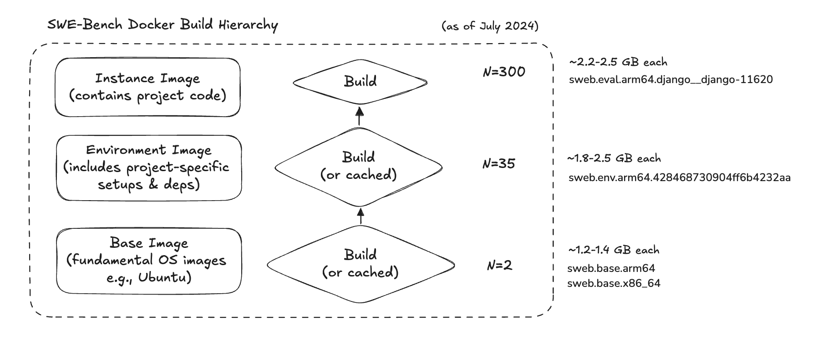
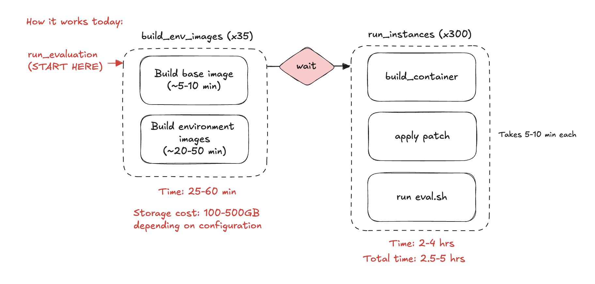
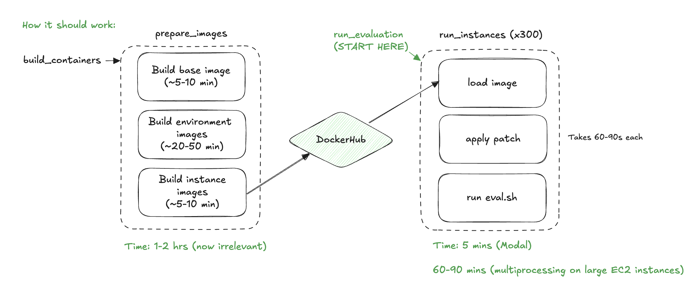

# SWE-harness

## Overview

Here's what the overview of how SWE-Bench works when run out of the box:



- There are three levels of containers being built:
  - Base images
  - Environment images
  - Instance images



- In total this process takes quite a bit of time and disk cost, especially if running locally on your local machine.

To improve on this, we propose the following changes:

- First, pre-build all of the Docker images in batch and save them to DockerHub.
- Then, at evaluation time, we load these images instead of re-building them.
- Finally, we can distribute the patch and evaluation scripts on a machine per container, meaning that we can run the entire dataset in parallel.
- This brings the final time from 2+ hours to 5 minutes, and the disk requirement from 100GB+ to minimal.
- The final cost on a provider like Modal is about 50 cents per run.



## Pre-built Docker images

Images are hosted here:

### SWE-Bench Verified

https://hub.docker.com/r/huyouare/swebench-verified

### SWE-Bench Lite

https://hub.docker.com/repository/docker/huyouare/swebench-lite/general

## Setup

We are using Python 3.10

### Installation on EC2 (Ubuntu)

Use instance `t3a.2xlarge`. Make sure it's x86 and not arm/amd.

Install Docker:

```bash
sudo apt install docker.io
```

Install pyenv and Python 3.10: https://ericsysmin.com/2024/01/11/how-to-install-pyenv-on-ubuntu-22-04/

Then install and run Poetry:

```bash
sudo apt install python3-poetry
poetry install --no-root
poetry shell
```

### Installation on personal machine (Mac)

Install poetry and then run:

```bash
poetry install --no-root
poetry shell
```

## Running evaluation on Modal

```bash
poetry run modal run run_evaluation_modal.py \
    --dataset-name "princeton-nlp/SWE-bench_Lite" \
    --split test \
    --predictions-path your_preds.jsonl
    --run-id your_run_name
```

## Running (outdated)

```bash
# Deploy the script to Modal and run the remote job
modal deploy main.py && modal run main.py::run_and_save
```

## Build and Push Images

Make sure to run `docker login` first.

### For EC2 (Ubuntu)

```bash
python prepare_images.py \
    --push_to_registry True \
    --only_x86_64 True \
    --use_buildx False \
    --dockerhub_username huyouare \
    --dockerhub_repo swebench-lite \
    --max_workers 8
```

### For Mac

```bash
docker buildx create --name mybuilder --use
docker buildx inspect --bootstrap
```

```bash
python prepare_images.py \
    --push_to_registry True \
    --only_x86_64 True \
    --use_buildx True \
    --dockerhub_username huyouare \
    --dockerhub_repo swebench-lite \
    --max_workers 4
```

## Notes

- You cannot build x86 from arm (e.g. M-series Macbooks) out of the box.
- This requires docker buildx, which is not set up by default.

If running on arm:

```bash
docker buildx create --name mybuilder --use
docker buildx inspect --bootstrap
```
